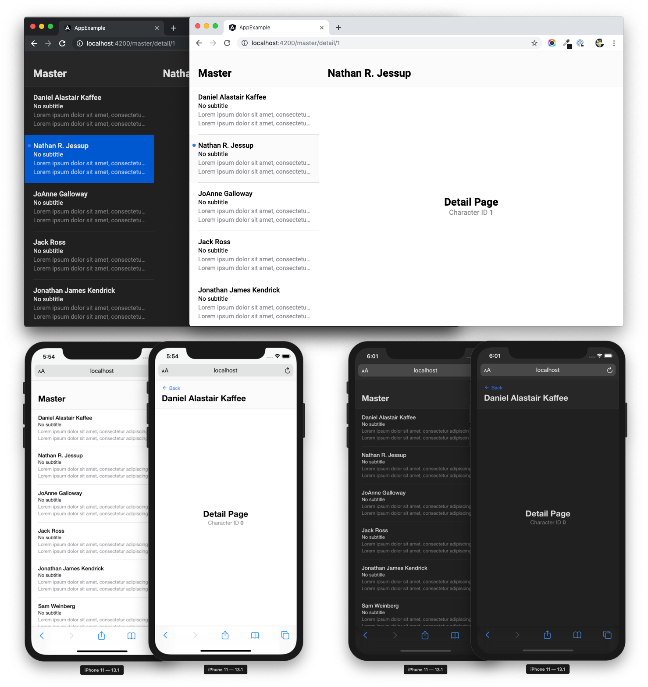

# **React** Master-Detail Component + Dark Mode

A quick experiment and demo of a responsive `master-detail` component in react. This is a companion repo for the following a new [blog post](), which is currently a work in progress.



## Quickstart

Run `npm i`, then:
* `npm run start` : Run app locally ([http://localhost:3000/](http://localhost:3000/))
* `npm run test` : Run tests

## Code Overview

1. **Container Components**: `<MasterContainer />` and `<DetailContainer />`
2. **Components**: `<MasterDetail />`, `<Header />`, `<ListItem />` and `<ListItemLink />` 

## How It Works &middot; TLDR

Basically there are 2 main tricks to make this work:

1. Use the `react-media` package to switch between two routing strategies
2. Use `react-media` to conditionally display a back button

## How It Works &middot; Detail

### <MasterDetail /> Component

This component takes in two component types and switches between routing strategies depending on the current screen size. The nice thing about this approach is that the routes are exactly the same for the different screen sizes, so there is not requirement for message conditional route logic. The relevate code snipped is displayed below:

```
import React from 'react';
import { Route, Switch, useRouteMatch } from 'react-router-dom';
import Media from 'react-media';
import { mediaQueries } from 'utils';
import styles from './MasterDetail.module.scss';

export interface MasterDetailProps {
    MasterType: any,
    masterProps: any,
    DetailType:  any,
    detailProps: any
}

export const MasterDetail: React.FC<MasterDetailProps> = (props) => {
    let { path } = useRouteMatch() as any;
    const master = (
        <props.MasterType {...props.masterProps}
            data-test="Master" />);
    const detail = (
        <props.DetailType {...props.detailProps} 
            data-test="Detail" />);

    return ( 
        <Media query={mediaQueries.md}>
            {matches =>
                matches ? (
                    <Switch>
                        <Route exact path={`${path}`}>
                            {master}
                        </Route>
                        <Route path={`${path}/detail/:id`}>
                            {detail}
                        </Route>
                    </Switch>
                ) : (
                    <section className={styles.component}>
                        <section className={styles.master}>
                            <Route path={`${path}`}>
                                {master}
                            </Route>
                        </section>
                        <section className={styles.detail}>
                            <Switch>
                                <Route exact path={`${path}`}>
                                    {detail} 
                                </Route>
                                <Route path={`${path}/detail/:id`}>
                                    {detail}
                                </Route>
                            </Switch>
                        </section>
                    </section>
                    )
            }
        </Media>
    );
};
```
*src/components/MasterDetail/MasterDetail.tsx* *(a simplified version)*

## Example Usage

Below is an example usage of the `<Master-Detail />` component:

```
import React from 'react';
import { BrowserRouter as Router, Route, Switch, Redirect } from 'react-router-dom';
import { MasterDetail } from 'components';
import { MasterContainer, DetailContainer } from 'containers';

export const App = () => {
  return (
    <Router>
      <Switch>
        <Route path="/master"
          render={props => (
            <MasterDetail MasterType={MasterContainer} masterProps={{}} 
                          DetailType={DetailContainer} detailProps={{}}/>
          )} />
        <Redirect exact from="/" to="/master" />
      </Switch>
    </Router>
  );
};
```

## BONUS: Dark Mode

Just for fun, the demo app supports dark mode on mac and ios. This is was done using simple CSS queries and the 'dark mode' query. See:

```
:root {

  --app-color-primary: rgb(52,120,245);

  /**********************************************/
  /* LIGHT MODE (DEFAULT)                       */
  /**********************************************/

  --app-color-background: rgb(255,255,255);
  --app-color-background-transparent: rgba(251,251,251,0.9);
  --app-color-background-highlight: rgba(251,251,251,0.9);

  --app-color-border: rgb(218,218,218);

  --app-color-text-primary: rgb(0,0,0);
  --app-color-text-primary-highlight: rgb(0,0,0);
  --app-color-text-secondary: rgb(142,141,146);
  --app-color-text-secondary-highlight: rgb(142,141,146);


  @media (prefers-color-scheme: dark) {

    /**********************************************/
    /* DARK MODE                                  */
    /**********************************************/

    --app-color-background: rgb(32,32,32);
    --app-color-background-transparent: rgba(40,40,40,0.9);
    --app-color-background-highlight: rgb(0,88,208);

    --app-color-border: rgb(45,45,45);

    --app-color-text-primary: rgb(223,223,223);
    --app-color-text-primary-highlight: rgb(223,223,223);
    --app-color-text-secondary: rgb(120,120,120);
    --app-color-text-secondary-highlight: rgba(255,255,255,0.6);

  }

}
```
*src/styles/_colors.scss* *(a simplified version)*

## About Project

This project was bootstrapped with [Create React App](https://github.com/facebook/create-react-app).